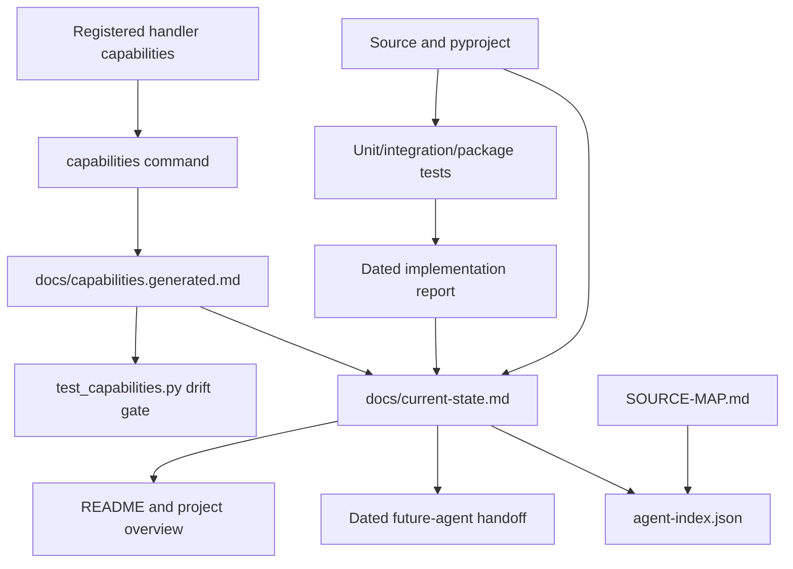

# Connection Map

This map links user claims to implementation owners and executable evidence. It is intended to prevent documentation, capabilities, and tests from drifting independently.

## Claim To Source To Evidence

| Claim or boundary | Source owner | Executable evidence | Narrative evidence |
| --- | --- | --- | --- |
| Version `0.4.0` has one source | `__init__.py`, `pyproject.toml` | `test_packaging.py`, CLI `--version` | README, changelog |
| Sources are immutable and changing inputs fail | `byte_source.py`, `pipeline.py` | `test_budgets_and_byte_source.py`, `test_safe_recovery.py`, `test_run_lifecycle.py` | Security, architecture |
| Paths are contained and outputs no-clobber/atomic | `paths.py`, `atomic.py`, handlers | `test_atomic_and_paths.py`, `test_archive_handler.py`, `test_safe_recovery.py` | Security, CLI |
| Resource ceilings are explicit | `budgets.py`, `cli.py`, `atomic.py` | budget, archive, safe-recovery, CLI tests | CLI, current state |
| External tools are bounded and optionally isolated | `process_runner.py`, `decoders.py` | `test_process_runner.py`, adapter/PDF tests | Security, architecture |
| Scan, classify, and recover differ | `cli.py`, `pipeline.py` | `test_cli.py` | CLI reference |
| Goals are explicit | `handlers/base.py`, registry, CLI | handler/capability/CLI tests | README, CLI |
| Capability claims derive from handlers | `handlers/*`, `capabilities.py` | `test_capabilities.py` | generated capabilities |
| Public families have mutation evidence | `tests/fixtures.py`, `tests/mutations.py` | `test_mutation_inventory.py` | testing docs, roadmap |
| Runs persist/resume safely | `db.py`, `pipeline.py`, `cli.py` | `test_db_migrations.py`, `test_run_lifecycle.py`, `test_cli.py` | architecture, CLI |
| Events/reports are separate and redactable | `events.py`, `reporting.py`, `cli.py` | CLI/lifecycle tests | CLI, security |
| Ground-truth/false-positive/RSS metrics are explicit | `benchmarking.py`, `cli.py`, `reporting.py` | `test_benchmarking.py`, CLI tests | benchmark schema, verification |
| Text fidelity and invalid structure are explicit | `handlers/text.py` | `test_text_handler.py` | roadmap |
| ZIP/TAR extraction is streaming, contained, and bounded | `byte_source.py`, `handlers/archive.py` | `test_archive_handler.py`, `test_streaming_handlers.py` | roadmap, security |
| Package documents stream parts without executing macros | `byte_source.py`, `handlers/package_document.py` | package/streaming tests | roadmap, security |
| PDF streaming/reconstruction/qpdf output validation is conservative | `handlers/pdf.py` | PDF/streaming tests | roadmap |
| Image frame/page loss is not full recovery | `handlers/image.py`, `decoders.py` | `test_image_handlers.py` | capabilities, roadmap |
| Media tool goals require FFmpeg+ffprobe and exact output validation | `handlers/media.py`, `decoders.py`, `capabilities.py` | capability/media/integration tests | current state, roadmap |
| 7z/RAR and LibreOffice/soffice Office boundaries are tool/format honest | `handlers/external.py` | `test_external_adapters.py` | capabilities, roadmap |

## Documentation Flow



## Handler Registration Chain

```text
constants/signatures
  -> bounded detection and classification
  -> handler registry ownership
  -> capability manifest
  -> inspect / explicit goal plan / execute
  -> atomic artifacts
  -> SQLite typed relations and JSONL events
  -> final reports
```

Adding an extension only at the constants layer is insufficient. A public variant must have an owner, operation levels, fixtures, safety limits, output semantics, fidelity statement, and tests.

## Run Lifecycle Chain

```text
validate paths/config
  -> create run
  -> discover/analyze in stable order
  -> per-file savepoint
  -> inspect and execute requested goals
  -> publish and persist evidence
  -> commit file
  -> finalize run
  -> render manifest/CSV/text
```

Cancellation, fatal configuration, and changed-source handling have explicit branches. A resumed run references prior evidence and uses a new output namespace for reprocessing; it does not overwrite the old run.

## Reports And Handoffs

| Artifact | What it establishes |
| --- | --- |
| `reports/2026-07-26-current-state-and-roadmap-assessment.md` | Pre-stabilization baseline and original gaps. |
| `reports/2026-08-05-stabilized-multiformat-implementation.md` | Implemented changes, commands, check results, and remaining gates. |
| `handoffs/2026-07-26-video-jpeg-misclassification-fix.md` | Concurrent classification repair that must remain preserved. |
| `handoffs/2026-08-05-stabilized-multiformat-recovery.md` | Current continuation and risk boundary. |

## Update Obligations

- Capability change: update handler, fixtures/tests, generated capability doc, roadmap/current state, and machine index.
- CLI/limit/exit change: update parser tests, README, CLI reference, commands, and machine index.
- Schema/evidence change: update migrations/tests, architecture, source map, and handoff.
- New format: update constants, detection/classification, handler registry, fixtures/mutations, integration tests, capability docs, security boundaries, and roadmap.
- Verification change: update the dated report; do not convert local evidence into CI/live/deployment claims.

## Agent toolkit connections

[Project identity](../.agent/project.yaml) → [root instructions](../AGENTS.md) →
[canonical workflows](../skills/) → [shared project processes](../.agent/workflows/README.md).
Native adapters point to canonical skills; [routing cases](../.agent/evals/skill-routing.md)
and [structural validation](../.agent/hooks/README.md) check different properties.
Policy adoption is recorded in [decisions](decisions.md); observed delivery evidence
belongs in the [bootstrap handoff](../handoffs/2026-10-07-agent-toolkit.md).
