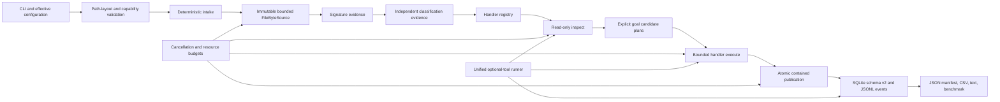

# Architecture

File Uncorrupter is a local Python CLI with an evidence-first recovery pipeline. The architecture separates discovery, classification, planning, execution, publication, and reporting so a new format cannot bypass global safety and provenance contracts.

## System Flow

## Architectural Invariants

1. The source path is never an output path.
2. Every source read is bounded and checked against the opened file identity.
3. Every recovery action belongs to an explicit goal.
4. Inspection is read-only; publication happens only during execution/report writing.
5. Every artifact path is contained below an approved root and existing destinations are preserved by default.
6. A writer or decoder accepting output is not sufficient evidence of full fidelity.
7. Candidate payload identity and recovery-strategy provenance are separate.
8. Optional tools use the same bounded process boundary and recorded identity.
9. Each file has an independent persistence boundary so one failure cannot erase earlier evidence.
10. Deterministic discovery, plan ordering, collision naming, result ordering, and manifest ordering are maintained wherever input/tool identity is unchanged.

## Command Layer

[`cli.py`](../../src/file_uncorrupter/cli.py) owns:

- parser and version surface;
- `capabilities`, `scan`, `classify`, `recover`, `benchmark`, and `report` dispatch;
- effective `ResourceLimits` construction;
- raw-path checks before path resolution;
- input/output/workspace/database compatibility;
- run creation/finalization and tool/platform snapshots;
- resume compatibility and changed-input policy;
- cancellation-marker token;
- external-tool isolation policy;
- stdout/stderr/JSONL separation;
- final reports and exit policy.

Fatal configuration/layout/capability errors return before recovery artifacts are produced. A report command reads persisted evidence without reopening source files.

## Intake And Immutable Byte Access

[`intake.py`](../../src/file_uncorrupter/intake.py) performs stable sorted discovery and rejects symlink/reparse traversal. [`byte_source.py`](../../src/file_uncorrupter/byte_source.py) opens each regular file as evidence:

- initial device/inode/size/mtime identity;
- bounded `read`, `prefix`, `tail`, streaming iterator, and lazy slices;
- streaming SHA-256;
- identity checks before and after reads;
- explicit `SourceChangedError` or `UnsafeSourceError` on drift/unsafe paths.

`SourceSlice` materialization consumes a separate materialized-byte budget. `SourceReader` exposes the same immutable source as a read-only seekable `RawIOBase` for ZIP/TAR, package, PDF, TIFF/Pillow, and other parsers. A large accepted source can therefore be streamed or accessed in bounded ranges without authorizing a same-sized memory copy.

## Budgets And Cancellation

[`budgets.py`](../../src/file_uncorrupter/budgets.py) defines immutable defaults and thread-safe hierarchical counters. A run tracker owns totals; file and goal children can impose equal or tighter limits. Consumption fails before the over-limit operation and emits structured budget evidence.

[`cancellation.py`](../../src/file_uncorrupter/cancellation.py) provides a token, reason, checkpoint exception, and optional marker-file cancellation. Checkpoints exist around analysis, goals, candidates, tools, and publication.

## Detection And Classification

[`signature_index.py`](../../src/file_uncorrupter/signature_index.py) examines bounded prefix/tail/anywhere windows. [`classification.py`](../../src/file_uncorrupter/classification.py) keeps four evidence sources distinct:

- declared extension;
- byte-0 signature;
- anywhere-in-source signature;
- handler/format structure.

This distinction is a routing safety feature. Embedded or polyglot signatures are evidence, not automatic ownership. The declared-video/embedded-JPEG regression is explicitly tested.

## Handler Registry And Contract

[`handlers/base.py`](../../src/file_uncorrupter/handlers/base.py) defines:

- `CapabilityRecord`: variants, extensions, signatures, operations, tools, limits, encryption, active content, outputs, fidelity, fixtures, and availability;
- `HandlerContext`: source, file record, classification, limits, budget, cancellation, and optional output root;
- `InspectionResult`: read-only structural evidence;
- `CandidatePlan`: lazy source ranges and expected cost;
- `FormatHandler`: `capabilities()`, `inspect()`, `plan()`, and `execute()`.

[`handlers/registry.py`](../../src/file_uncorrupter/handlers/registry.py) enforces deterministic registration and variant ownership. The current registry owns text, archive, package document, PDF, image, JPEG, media, external archive, RTF, and legacy Office families.

Inspection must not publish. A plan must match the requested goal. Execution returns artifacts and an explicit `OutcomeGrade`.

## Pipeline And Coordination

[`pipeline.py`](../../src/file_uncorrupter/pipeline.py) has two generations:

- compatibility methods used by the earlier engine-oriented tests;
- the stabilized `analyze_path(s)` and `process_path(s)` coordinator.

The stabilized path:

1. builds a bounded byte source and streaming hash;
2. creates independent detection/classification evidence;
3. resolves exactly one handler owner;
4. performs read-only inspection;
5. creates plans for each requested goal;
6. executes in deterministic goal/plan order under child budgets;
7. optionally publishes a selected raw candidate;
8. rechecks the source identity/hash boundary;
9. captures published artifacts even if a later artifact hits a budget;
10. persists file/goal/attempt/typed evidence.

`process_paths` can use a bounded thread pool, but it returns and persists results in stable discovery order. File savepoints isolate failures.

## Artifact Publication

[`paths.py`](../../src/file_uncorrupter/paths.py) validates root relationships and safe relative names. [`atomic.py`](../../src/file_uncorrupter/atomic.py) owns:

- temporary siblings under the destination directory;
- streamed writes and SHA-256 calculation;
- output-byte and artifact-count budgets before final publication;
- durable flush and `fsync` where available;
- atomic replacement/rename primitives where the host filesystem supports them;
- fail/suffix/replace collision policies, with fail/no-clobber as the normal product boundary;
- cleanup of incomplete temporary files.

Handlers must use this publisher or a helper that delegates to it. Direct writes are not a valid handler publication path.

## External Process Boundary

[`process_runner.py`](../../src/file_uncorrupter/process_runner.py) centralizes subprocess behavior:

- resolved executable identity and bounded version probe;
- minimal allowlisted environment;
- temporary working directory;
- no shell string execution;
- stdout/stderr byte ceiling;
- timeout and cancellation;
- process-tree termination and cleanup result;
- structured `ProcessResult` and tool records;
- run-wide required-isolation wrapper that local call policies cannot bypass.

[`decoders.py`](../../src/file_uncorrupter/decoders.py) contains Pillow and FFmpeg/ffprobe primitives. Pillow accepts the seekable source adapter and produces temporary encoded files that are validated before streamed publication. When FFmpeg and ffprobe are both available, the media handler exposes copy-remux normalization, per-stream extraction, and one-frame preview plans. Every temporary output is independently probed, hashed, streamed through the atomic writer, and checked so the published hash equals the validated hash.

The public tool path uses the immutable source path directly. A source with removable prefix damage is streamed into a temporary tool input after the prefix; it is not copied into a source-sized Python `bytes` value.

## Persistence Model

[`db.py`](../../src/file_uncorrupter/db.py) maintains SQLite schema version 2 with additive migrations. Main tables:

- `runs`, `files`, `signatures`;
- `candidates`, `candidate_strategies`, `attempts`;
- `outputs`, `artifact_relations`, `frames`;
- `events`, `budget_events`, `tool_records`;
- `text_spans`, `archive_members`, `document_parts`, `media_streams`;
- `schema_meta`.

Run records capture effective configuration, platform, application version, tool snapshot, lifecycle timestamps, fatal errors, database path, and optional resume parent. File records capture source identity/hash and status/outcome. Artifact relations preserve plan, transformation, validator, source, and tool provenance.

JSON persistence is sanitized: `Path`, enums, sets, and byte payloads are converted without storing raw source content. Byte values are represented by length/hash evidence.

## Resume Model

Resume is a new run linked to prior evidence, not mutation of history. Compatibility requires the expected source/output/configuration contract. Unchanged completed files are skipped/reused. Changed inputs follow `abort`, `skip`, or `reprocess`; reprocessing uses a fresh `_resumed/run-NNNNNN/` output namespace.

This design preserves earlier artifacts and makes changed-source decisions reviewable.

## Events And Reports

[`events.py`](../../src/file_uncorrupter/events.py) creates an exclusive JSONL stream and durably flushes each monotonically sequenced event. Event families include lifecycle, file, candidate, tool, budget, artifact, and goal outcomes.

[`reporting.py`](../../src/file_uncorrupter/reporting.py) renders:

- ordered JSON final manifest;
- attempt CSV;
- human text summary;
- benchmark metrics.

[`benchmarking.py`](../../src/file_uncorrupter/benchmarking.py) validates versioned ground-truth labels, evaluates global/per-group classification, recovery, fidelity, false-positive, and false-negative metrics, and samples main-process RSS. Child-process memory is deliberately excluded and stated in the emitted evidence.

Optional path redaction replaces configured roots with stable salted IDs. Content excerpts are not emitted by default. Report destinations use atomic no-clobber publication.

## Format Implementations

| Module | Ownership |
| --- | --- |
| `handlers/text.py` | Text decoding, spans, structure diagnostics, normalization. |
| `handlers/archive.py` | ZIP/TAR validation, extraction, reconstruction/resynchronization. |
| `handlers/package_document.py` | Open XML/OpenDocument package validation and part recovery. |
| `handlers/pdf.py` | Native PDF structure, conservative repair, extraction, optional qpdf. |
| `handlers/image.py` | PNG/GIF/BMP/WebP/TIFF and optional-codec image structures. |
| `handlers/legacy_media.py` | Current JPEG bridge into the candidate engine/decoders. |
| `handlers/media.py` | Streaming video/audio structural inspection, conservative native recovery, and conditional validated FFmpeg goals. |
| `handlers/external.py` | 7z/RAR, RTF, and conditional LibreOffice/soffice legacy Office preview adapters. |

The older [`engines/`](../../src/file_uncorrupter/engines/) modules remain useful for JPEG and compatibility candidate generation, but they no longer define the entire public format surface.

## Extending The Architecture

To add a format:

1. add bounded synthetic fixtures and mutation applicability;
2. add extension/signature constants without claiming operations;
3. implement native inspection separately from recovery;
4. define goal-specific lazy plans and cost estimates;
5. publish only through the atomic writer;
6. validate exact outputs and assign honest grades;
7. persist typed relations/tool evidence;
8. register one owner and add capability drift tests;
9. update generated and narrative documentation;
10. add corpus metrics before promoting a capability level.

See [Capabilities and roadmap](../CAPABILITIES-AND-ROADMAP.md) for format-specific next steps.
